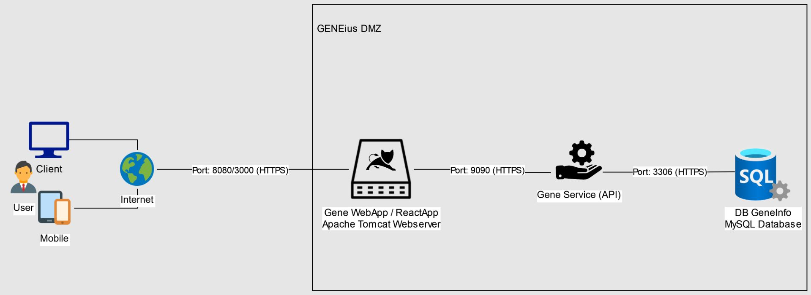
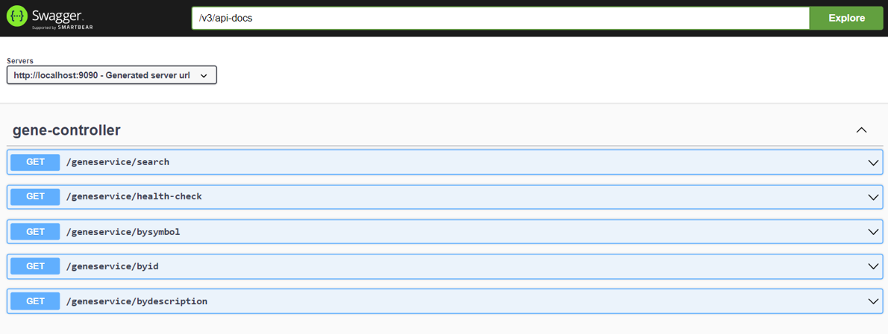
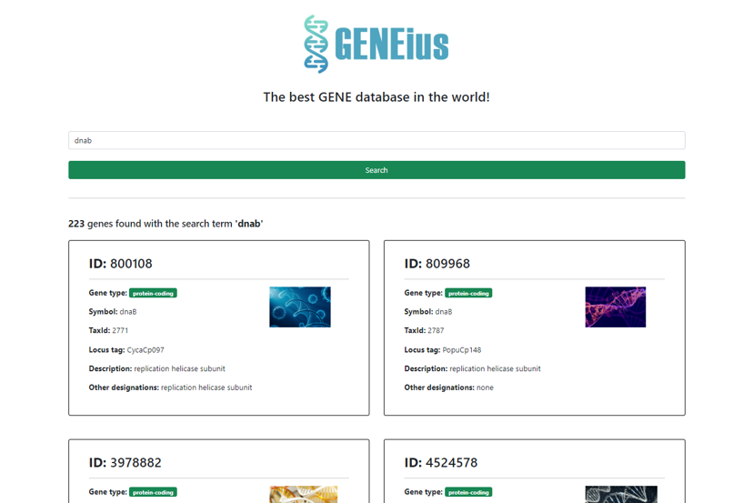

<p align="center">
  
</p>

## Data
The gene data (~36.5M records, ~5GB) can be downloaded from here: ftp://ftp.ncbi.nlm.nih.gov/gene/DATA/gene_info.gz

Place the downloaded tsv file in the root folder of this project into a folder called ./dataloader/data and name it 'gene_info.tsv'.

## Purpose
This repository will hold the projects for the different exercises in the module "Medical Software Development".  

### System landscape


### Projects
- dataanalyzer
  - a python script which will load the tsv file and extract its data into a pandas dataframe to perform basic analyzing and row counting
  - note: these python packages are required to run the script:
    ```
    jupyterlab
    pandas
    matplotlib
    ```
- dataloader
  - a java project for loading the data into a MySQL database. Due to the high volume of data, the script can run for several minutes.
  - works with Apache Ant
    ```
    ant clean && ant dist
    ```
 - geneservice (:9090)
   - REST API Webservice created with Java SpringBoot
   - connects to the MySql gene database running on port 3306
   - ```<java.version>17</java.version>```
   - Uses Maven as build tool
      ```
      mvn clean && mvn package
      ```
   - creates logs with logback under the folder "logs" with a RollingFileAppender (one log file per day)
   - uses Swagger-UI to describe the various endpoints (http://localhost:9090/swagger-ui/index.html)
   
  - genewebapp (:8080)
    - JSF web application
    - connects to the API
    - ```<java.version>17</java.version>```
    - Uses Maven as build tool
      ```
      mvn clean && mvn tomcat7:redeploy
      ```
      
    - Addtitional features: Pagination, API status message, custom styling with Bootstrap 5, additional table column "taxId"
  - genereactapp (:3000)
    - additional gene client application
    - connects to the API
    - responsive design for mobile devices
    - highlight: pagination through infinite scroll feature
    - React uses NPM as package and build tool
      ```
      npm install
      npm run start
      ```
      